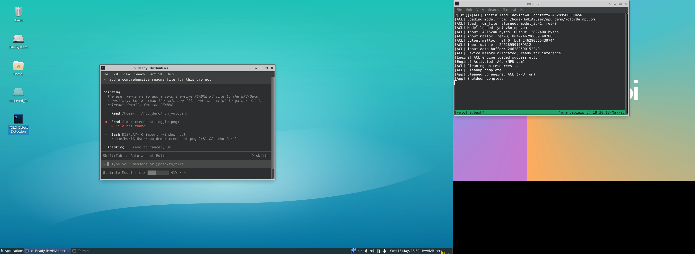

# NPU-Demo: YOLOv8 Real-Time Object Detection on Orange Pi AI Pro

Real-time object detection application leveraging the **Ascend 310B4 NPU** on Orange Pi AI Pro. Achieves ~28 FPS using the ACL (Ascend Computing Language) engine with a pre-compiled `.om` model, featuring a full GUI with live engine switching between ACL, torch_npu, and CPU backends.



## Features

- **Three inference backends** with runtime switching:
  - **ACL (NPU .om)** - Direct Ascend Computing Language API, ~28 FPS, lowest latency
  - **torch_npu (NPU)** - PyTorch with Ascend NPU backend, FP16 enabled
  - **CPU (fallback)** - Ultralytics on CPU, guaranteed compatibility
- **Optimized preprocessing** - Zero-allocation CHW conversion directly into pre-allocated device buffers
- **Adaptive frame skipping** - Seeks ahead when inference is slower than video FPS
- **Display throttling** - Skips alternate canvas updates above 20 FPS to reduce GUI overhead
- **Thermal watchdog** - Pauses inference above 75C, resumes below 70C with hysteresis
- **NPU monitoring** - Live temperature, power, AI Core usage, and memory stats
- **Tkinter GUI** - Dark theme with video playback controls, detection overlay, and performance metrics

## Hardware Requirements

- **Board**: Orange Pi AI Pro (8GB/16GB/20GB)
- **NPU**: Ascend 310B4
- **CANN Toolkit**: 8.0.0+
- **OS**: Ubuntu 22.04 (Orange Pi official image)

## Software Dependencies

```bash
# Python packages
pip install opencv-python numpy pillow ultralytics

# System packages (pre-installed on Orange Pi AI Pro)
# - CANN toolkit (provides acl module)
# - npu-smi (NPU monitoring)
# - tmux (session protection)
```

## Project Structure

```
NPU-Demo/
├── yolo_detection_app_npu.py   # Main application (1100+ lines)
├── run_yolo.sh                 # Launch script with tmux + NPU env setup
├── yolov8n_npu.om              # Pre-compiled Ascend OM model (FP16, batch=1)
├── yolov8n.pt                  # PyTorch model (for torch_npu/CPU backends)
├── yolov8n.onnx                # ONNX model (intermediate for OM conversion)
├── videos/                     # Sample test videos
│   ├── face-demographics.mp4
│   ├── person-bicycle-car-detection.mp4
│   └── world.mp4
├── screenshot.png              # App screenshot
└── README.md
```

## Quick Start

```bash
# Clone the repository
git clone https://github.com/shenqs/NPU-Demo.git
cd NPU-Demo

# Launch the app (starts in tmux session)
bash run_yolo.sh

# If X11/terminal disconnects, reconnect with:
tmux attach -t yolo
```

The app will:
1. Initialize the ACL engine and load the `.om` model onto the NPU
2. Auto-load the first sample video
3. Begin detection automatically once both engine and video are ready

## Usage

### Engine Toggle

Use the **Engine** dropdown in the left panel to switch backends at runtime:
- Switching stops detection, swaps the engine, and restarts automatically
- ACL engine stays cached in memory for instant re-activation
- CPU engine is lazy-loaded only when first selected

### Detection Settings

- **Confidence threshold** (0.1 - 0.9): Minimum detection confidence
- **IOU threshold** (0.1 - 0.9): Non-maximum suppression overlap threshold

### Video Sources

- Select from sample videos in the dropdown
- Click "Open File..." to load any .mp4/.avi/.mov/.mkv file

## Architecture

### ACL Engine Pipeline

```
Frame → Letterbox Resize → Normalize (uint8→fp32) → HWC→CHW
     → H2D memcpy → NPU Execute → D2H memcpy
     → Postprocess (NMS) → Draw Boxes → Display
```

Key optimizations:
- Pre-allocated device memory buffers (reused every frame)
- `np.multiply` with output parameter for zero-allocation normalization
- Explicit ACL context management for thread safety
- Synchronous execution with `acl.rt.synchronize_device()`

### Performance Characteristics

| Backend | FPS | Latency | Notes |
|---------|-----|---------|-------|
| ACL (NPU .om) | ~28 | ~36ms | Pre-compiled, FP16, direct memory control |
| torch_npu (NPU) | ~10-15 | ~70-100ms | Graph Engine JIT, FP16 enabled |
| CPU (fallback) | ~3-5 | ~200-300ms | Ultralytics on ARM Cortex-A55 |

### Model Conversion

The `.om` model was converted from ONNX using the ATC (Ascend Tensor Compiler):

```bash
# Export YOLOv8n to ONNX
yolo export model=yolov8n.pt format=onnx opset=11 imgsz=640

# Convert ONNX to OM (run on Orange Pi with CANN toolkit)
atc --model=yolov8n.onnx \
    --framework=5 \
    --output=yolov8n_npu \
    --soc_version=Ascend310B4 \
    --input_shape="images:1,3,640,640" \
    --input_format=NCHW
```

## Troubleshooting

### NPU device busy / memory leak
```bash
# Reset the NPU device
npu-smi set -t device-reset -i 0
# Or reboot if reset doesn't clear it
sudo reboot
```

### ACL init fails
- Ensure CANN toolkit environment is sourced: `source /usr/local/Ascend/ascend-toolkit/set_env.sh`
- Check that no other process holds the NPU: `npu-smi info`

### Low FPS
- Check NPU temperature with `npu-smi info -t temp -i 0` (thermal throttle above 75C)
- Ensure `ASCEND_LAUNCH_BLOCKING=1` is set (serializes transfers, reduces DDR contention)
- Close other NPU-consuming processes

### Display not showing
- Ensure X11 is running: `echo $DISPLAY` should show `:0`
- If using SSH, enable X11 forwarding: `ssh -X user@host`

## License

MIT

## Acknowledgments

- [Ultralytics YOLOv8](https://github.com/ultralytics/ultralytics)
- [Huawei Ascend CANN Toolkit](https://www.hiascend.com/)
- [Orange Pi AI Pro](http://www.orangepi.org/)
